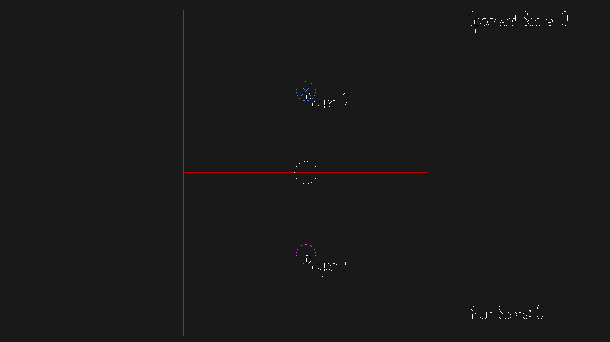

# pOng

Author: David Zelong Fan

Design: A pong-like game where players try to score the goal and avoid getting scored.

Networking: Networking mostly follows the base code, where all player input is sent to the server. The server will compute the corresponding player position, ball position, and scoring (Game.cpp). These information is then sent back to the player and drawn by the player (PlayMode.cpp).

Screen Shot:

How To Play:

Use WASD to move. Score 5 goals to win.

Note: The game only accepts the first two connections as player 1 and player 2. I did not plan for reconnections.

Sources:

This game was built with [NEST](NEST.md).

